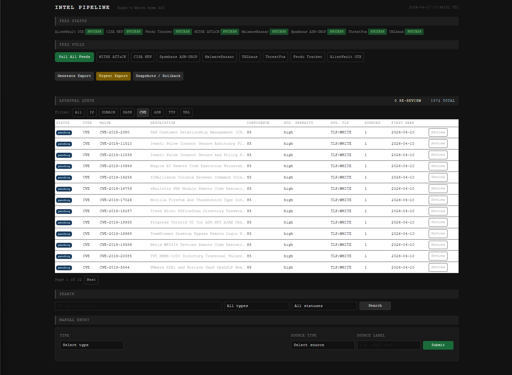
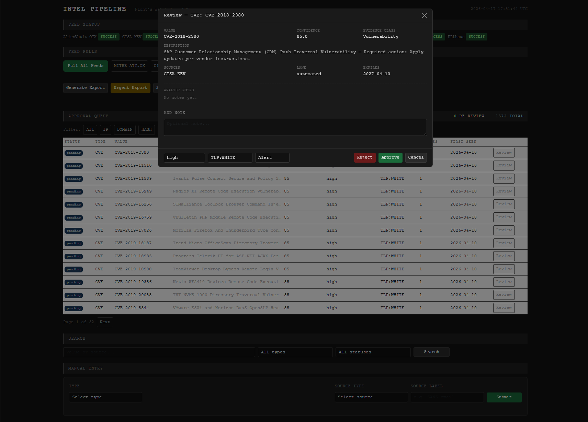
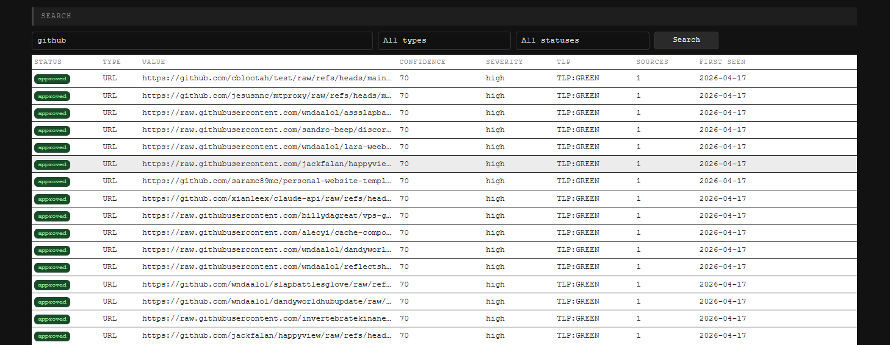
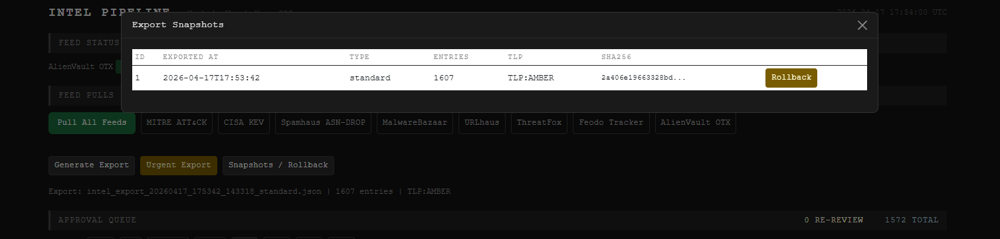

# Intel Pipeline

A standalone threat intelligence ingestion, normalization, analyst approval, and export
pipeline. Part of the Night's Watch Home SOC Suite.

Pulls indicators from 8 automated feeds, scores them with corroboration-based confidence,
routes them through an analyst approval queue, and exports approved indicators as signed
JSON snapshots.



*Single-page Flask dashboard on port 6001. Feed status strip, manual pull controls,
export management, and a filterable approval queue.*

---

## Features

- **8 automated feed pullers** — Tier 1 and Tier 2 sources covering IPs, domains, URLs,
  hashes, CVEs, and TTPs
- **GreyNoise enrichment** — on-demand IP context during analyst review
- **Corroboration confidence model** — confidence rises when independent sources agree;
  same-source repeat pulls never inflate scores
- **Phase-based confidence decay** — indicators decay in two phases based on type TTL;
  TTPs never expire
- **Analyst-in-the-loop approval** — all indicators must be reviewed and approved before
  export
- **TLP-aware export** — JSON snapshots with separate SHA256 sidecar; last 5 snapshots
  retained with rollback support
- **Flask dashboard** — dark-theme single-page app on port 6001; feed health strip,
  approval queue with type filtering, export management

---

## Analyst Workflow

### Approval Queue

Every indicator pulled from a feed lands in the approval queue with a `pending` status.
Analysts filter by type (IP, Domain, Hash, CVE, ASN, TTP, URL) and review each entry
before it becomes eligible for export.

### Review Panel



The review panel shows the full normalized entry — value, confidence score, evidence
class, description, source feed, lane (automated / manual), and expiry. Analysts can
add notes, adjust suggested severity and TLP, and choose **Approve**, **Reject**, or
**Alert** (flag for immediate attention).

### Search and Filter



Free-text search across value and source fields, combined with type and status filters,
enables quick review of specific indicator patterns — here showing approved URL
indicators hosted on GitHub infrastructure from URLhaus feed pulls.

---

## Export and Verification



Exports produce a timestamped JSON snapshot with a matching SHA256 sidecar. The last
five snapshots are retained, and any previous snapshot can be rolled back as the
current export. Each snapshot records entry count, TLP classification, and the full
hash for verification.

Verify the most recent export:

```
python verify_export.py
```

List all retained snapshots:

```
python verify_export.py --list
```

Verify a specific snapshot:

```
python verify_export.py intel_approved_20260410_143022_123456.json
```

Exit code 0 = verified. Exit code 1 = tampered or missing.

---

## Feed Sources

| Feed | Type | Tier | Indicators |
|---|---|---|---|
| MITRE ATT\&CK | TTP | 1 | Techniques (T-codes) |
| CISA KEV | CVE | 1 | Known Exploited Vulnerabilities |
| Spamhaus ASN-DROP | ASN | 1 | Hijacked / malicious ASNs |
| MalwareBazaar | Hash | 1 | Recent malware sample SHA256s |
| Feodo Tracker | IP | 1 | Active C2 botnet IPs |
| URLhaus | URL | 2 | Active malware distribution URLs |
| ThreatFox | IP/Domain/URL/Hash | 2 | Multi-type threat indicators |
| AlienVault OTX | IP/Domain/URL/Hash | 2 | Community threat pulses |

GreyNoise is used for enrichment only — not a feed source.

---

## Confidence Model

- **Base weight** — set per feed (70–85 depending on tier)
- **New independent source** — +10 corroboration bonus
- **Same-source repeat pull** — `last_seen` updated, no bonus
- **Tier 3 sources** — capped at 60 until a Tier 1 source corroborates
- **Expired re-observation** — confidence resets to feed base weight, entry returns to pending

---

## Decay Schedule

| Type | Early phase TTL | Early penalty | Late phase TTL | Late penalty |
|---|---|---|---|---|
| IP / Domain / URL | 7 days | -10 | 21 days | -20 |
| ASN / Hash | 30 days | -10 | 90 days | -20 |
| CVE | 90 days | -10 | 180 days | -20 |
| TTP | permanent | — | — | — |

---

## Setup

### Requirements

- Python 3.10+
- pip packages: `flask`, `requests`, `python-dotenv`

```
pip install flask requests python-dotenv
```

### API Keys

Copy `config.example.env` to `.env` and fill in your keys:

```
cp config.example.env .env
```

| Key | Source | Required |
|---|---|---|
| `ABUSE_CH_API_KEY` | auth.abuse.ch | Yes (MalwareBazaar, URLhaus, ThreatFox, Feodo) |
| `OTX_API_KEY` | otx.alienvault.com | Yes (OTX) |
| `GREYNOISE_API_KEY` | greynoise.io | No (leave blank for unauthenticated, 10 lookups/day) |

MITRE ATT&CK, CISA KEV, and Spamhaus require no API key.

### First Run

```
launch.bat
```

Opens a persistent terminal window and starts the Flask server on port 6001.
Navigate to `http://localhost:6001` in your browser.

The database is created automatically at `Data\intel.db` on first startup.

---

## Project Structure

```
Intel\
├── src\
│   ├── app\
│   │   └── app.py              — Flask dashboard (all routes)
│   ├── db\
│   │   ├── database.py         — Schema, connection, audit log
│   │   └── ingest.py           — Insert / update / corroboration logic
│   ├── feeds\
│   │   ├── base.py             — BaseFeed (pull, normalize, ingest, health log)
│   │   ├── runner.py           — Parallel feed orchestration
│   │   ├── greynoise.py        — IP enrichment (not a feed)
│   │   └── [mitre, cisa_kev, spamhaus, malwarebazaar,
│   │        urlhaus, threatfox, feodo, otx].py
│   ├── normalizer.py           — Raw to normalized entry, TLP suggestion
│   ├── decay.py                — Phase-based confidence decay
│   └── exporter.py             — JSON export, SHA256 sidecar, rollback, pruning
├── verify_export.py            — Standalone export verification tool
├── launch.bat                  — Start server (persistent terminal)
├── config.example.env          — API key template (commit this, not .env)
├── .gitignore
└── Documentation\
    ├── Intel_Test_Guide.md
    └── Screenshots\            — Dashboard screenshots used in this README
```

---

## Status Lifecycle

```
pending -> approved / rejected
pending -> pending_review (feed update changes a significant field)
approved -> pending_review (feed update changes a significant field)
approved -> expired (decay reaches 0)
expired -> pending (re-observed by a feed — confidence resets)
```

---

## Part of the Night's Watch Home SOC Suite

This pipeline is Phase 1 of a standalone threat intelligence layer.
Phase 2 will define the export schema and integration contracts with the SOC
correlation engine.